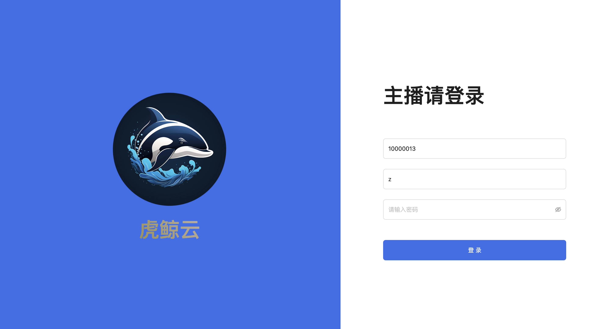

# 虎鲸云 直播主播端

## AD 欢迎大佬们关注公众号 pinkhello 与 🌍 

- 公众号
    
    

- 个人🌍
    
    

## 项目介绍
 
 > 专注提供私域直播的开源的SAAS解决方案。
 
## 项目组成

- [运营管理端](https://github.com/orca-yun/orca-admin)

- [直播助播端](https://github.com/orca-yun/assis-client)

- [直播主播端](https://github.com/orca-yun/anchor-client)

- [直播观看端](https://github.com/orca-yun/audience-client)

- [直播后端服务](https://github.com/orca-yun/living)

- [基础服务-视频直播](联系+V: pink-hello 索取)

- [基础服务-白板服务](联系+V: pink-hello 索取)

- [基础服务-动弹服务](联系+V: pink-hello 索取)

## Demo 地址
- https://admin.orcacl.com/app/audience#home?key=?

## 项目功能 🔨

虎鲸云直播主播端

- 互动消息
- 白板消息
- 推流
- 开启直播
- 屏幕分享
- 课件管理
- ...

# 界面展示

 
 

